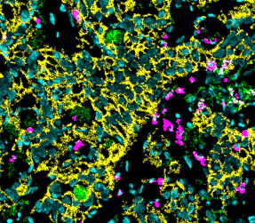
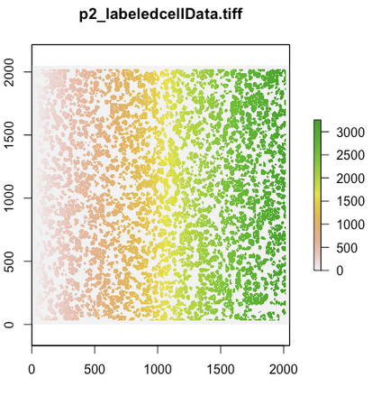
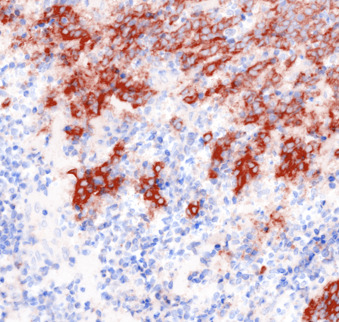

# What's different?

Good problems follow from new types of data. So, let's think carefully about
what makes these data different from what we're used to, and see if we can
identify some needs that may recur in future analyses.

Here are four new characteristics of these data, relative to the work that we're
already used to[^Reducing dimensionality of single / pairs of tables and
comparing them with observed phenotypes.],

* We have images / graphs.
* $n$ has an ambiguous relationship (>? or <?)with $p$.
* There is a cost-richness tradeoff between the MIBI and TOF technologies.
* Absence of pairing: No sample was measured using both technologies.

_Images / Graphs_: We're used to performing dimensionality reduction on tables
of numbers, where each column already has some pre-specified meaning ("amount of
CD4"). But these data come with images, each of which is associated with a
biopsy (for TOF) or a cell (for MIBI). We need to extract meaningful features
from these images: either from the raw pixels or the graph derived by looking at
co-located cells. For example, the amount of mixing between immune vs. tumor
cells is supposed to be predictive of survival, but it's not something measured
directly by any sensors.

Here's a MIBI image. For each cell, we have marker intensities.
 

The way the cells are linked is made clear here -- each color maps to an ID in
the marker intensity dataset.

Here's a TOF image. We have marker information per cell in this sample, but
those cells are not associated with the cells that we can see in this biopsy.
 

_$n$ vs. $p$_: In one sense, $n > p$, because we have more cells (~ millions)
compared to markers (~ 50). So, suddenly, complex density estimation methods
(nearest neighbors, trees, association rules, neural nets) become more
appealing. That said, there are many implicit features that we could extract
from the images (like spatial heterogeneity), which aren't reflected in the $p$
that you get just counting markers. Also, in another sense, $n << p$, because
there are still very few biopsy samples (we just have many cells per sample).

_Cost-Resolution tradeoff_: People always want the best possible data at the
least possible cost. In this instance, we'd like to have MIBI images for all
samples, but they are way more expensive to collect than TOF. Helping people
design their experiments / analyze their results in a way that lets them get
good sample coverage (using cheap tech) and useful features (from expensive
tech) is a general challenge.

_Absence of pairing_: I'm not sure if this will be a problem in future studies,
but in our particular data, we have no individual sample that was measured using
both technologies. This means that standard two-table methods (like CCA) are not
really relevant. We have to rethink what we mean by "integrating" datasets --
we're used to column-wise integration (with shared rows), not row-wise
integration (with only partially shared columns). In a sense, what we're
attempting is more like imputation than canonical correlation: we're trying to
fill in what it would have been like to have one type of measurement, when we
only had a different one.

Each of these points probably warrants specific study, but we should think
through some baseline analysis that accounts for each of these properties.
Otherwise, we'll never get started with this data.

# How to tell we've succeeded?

For data as complex as this, it would be easy to go on plotting or fitting
things forever. What tangible products (lists of numbers, relations, or
diagrams) should we be aiming for, and how would we tell that these "products"
are useful?

First, let's consider some of the tangible statistical products at the
single-table level. For either TOF or MIBI in isolation, we'd typically look for
new features that have some sort of phenotypic meaning (e.g., factors of
variation in PCA). In our case, we also have images / graphs, which warrant more
specific feature extraction. These new features can be used to produce "maps"
that explain the similarity and differences between cells (or tissue
samples[^One idea: we can create separate maps for each tissue sample, where
points represent cells, and then create a map of maps, relating the samples to
one another]).

In addition, at a single table level, we're often seeking some sort of
attribution. We want to say that certain phenotypic outcomes (e.g., expected
survival time) can be attributed to particular characteristics of the inter-cell
ecosystem (e.g., spatial heterogeneity). This either takes the form of a kind of
multiple testing or variable importance summary. We'll want some inferential
guarantees about these attribution statements, if we want to avoid a fine from
the statistics police.

For evaluation of these single table analysis, it's natural to study whether the
learned factors in these analysis are useful for downstream tasks. This is what
we implicitly do when we notice nice separation between phenotypes in PCA
biplots. Alternatively, we can split the data and study the stability of our
attributions across subsets. If we find the same feature useful on a new split,
then we have higher confidence that what we're picking up on is real.

## Multiview Analysis: Imputation / Prediction

Second, let's consider what some of the tangible products for the multi-table
case look like. In an ideal world, we'd be able to generate the high-resolution
features from just low-resolution measurements. That in fact seems to be the
premise of the BANF challenge ("how do you integrate across partially
overlapping data, coming from different patients").

This is of course impossible: you can try to generate proxy MIBI features from
just TOF, using some sort of imputation technology, but the information
contained in the sample has not changed. That said, perhaps the proxy is a very
good re-expression of the TOF data, which is useful in downstream tasks. That
is, MIBI might be useful in learning good transformations of the TOF data [^For
another analogy, even in the absence of samples measured on both instruments,
the shape of the MIBI samples might influence your prior when dealing with
TOF.]. Of course, if the proxy features are of interest in their own right, then
the imputation doesn't need all this elaborate justification.

For evaluation, I'd want to see how phenotype prediction changes when you
include the proxy features. If the performance increases (relative to prediction
without the proxy), then that's evidence that integrating the MIBI proxies into
the TOF data is a worthwhile exercise. If it's not any better, then I'd be
comfortable running two separate single-table analysis (though, see comments in
the last paragraph below).

## Multiview Analysis: Linking

* Imputation is quite a bit of machinery to implement, and would be helpful to
  have some indications that the direction has promise
* We can try informally linking the conclusions from the two types of data,
  without all this machinery
  - E.g., you can get clusters from each type of dataset
  - Can you map the clusters onto one another? In theory, you could link them
    based on values in shared features
  - Is enrichment of clusters within particular phenotypes consistent across the
    two studies?

## Spatial Co-location

As an aside, there is a particular outcome using only the MIBI data that might
be special interest, and which seems way easier to obtain. The organizers are
interested in recovering the spatial co-location of cells, without explicitly
using the x-y coordinates in MIBI. The idea seems to be that, if you knew how
certain markers were related for spatially co-located cells, then you'd be able
to directly measure those markers in TOF data without having to run MIBI in the
first place. This seems like a directly solvable problem, without any need for
two-table integration. Here, success is measured according to,
* the ability to predict spatial co-location from just the marker measurements
* the ability to predict the neighborhood cell-type composition, from just the
  marker measurements
  
I actually suspect the second approach will be more useful. There are probably
cells that look very similar in marker space, but which are physically very
distant. That said, I would expect them to have similar functions, and to be
surrounded by similar types of cells. For example, I wonder whether an immune
cell that's invaded deep into a tumor always has a particular marker profile.

Finally, a few somewhat vague ideas, which I'm not sure where to put. One idea
is that, even if the "proxy" MIBI features aren't worth creating, there might
still be improvements over simply analyzing each data source separately.
* We could propose ways to streamline analysis across the separate tables. This
  is in the spirit of phyloseq -- a good medium for working with different
  sources can make analysis feel integrated, even if statistically we're
  essentially analyzing tables separately.
* We could have ways to summarize the results from multiple analyses, which
  highlights the ways in which the findings are complementary. I want to say
  that certain types of sensors are "orthogonal" to one another, but I have no
  way of making that formal, especially considering we never have the same
  sample across many sensors.

So, even if there is no improvement in statistical efficiency, there still might
be potential for improvement in workflow or reporting efficiency.

# Exploratory Analyses

Here are some ideas for becoming more familiar with the data, more generally.

## Subsampling

While these data are pleasantly sample-rich, for fast and cheap views, it will
be nice to subsample to say 50K cells.

## Cells

This is a cell-level analysis. We're looking for the typical groups of channels
that are on or off together, at the level of individual cells. This analysis is
repeated twice (one for MIBI, one for Cytof), and ignores relationships between
the two datasets.

It's the simplest type of analysis of these data, but is worth doing, as due
diligence.

I. We've looked at marginals already. What are relationships between channels?
  A. Make a pairs matrix
    1. Do you notice the usual mass spec mixture plots?
  B. Make a heatmap across channels
    1. Do you recover typical clusters of cells?
    2. Are the clusters of cells related to any phenotypes?
      i. E.g., plot #'s in each cluster vs. cancer types
II. How do those relationships change, when you subset to,
  A. Different clusters of cells
  B. Different phenotypes for biopsies
  C. Maybe -- association rules?
    1. Cancer type 1 -> lots of CDX and T-CellZ?
    2. Since it's so dense, we might be able to estimate
    3. Of course, more interested in relationships across clumps of cells and
       sensing devices

## Clumps of Cells

Things get more interesting when we study clumps of cells at a time. People in
this field seem to like speaking of an "ecology" of cells -- barriers between
tumors and immune cells, certain cells "invading" the tumor. Studying one cell
at a time misses this. We should try to understand how relationships between
cells / mixings across cell types vary across phenotypes.

This is again per-device, though.

I. Windowed averages
  A. Using the already defined cells, look at cell type compositions within
  moving windows
    1. This gives a distribution over compositions (distn on simplex)
    2. Are there relationships between these distributions and observed phenotypes?
      a. E.g., are those with higher cell heterogeneity related to survival time?
  B. In theory, can do this with image features too
    1. Would be interesting to find image prototypes
      a. "border region"
      b. "high density immune"
      c. "low density tumor"
II. Graphs
  A. Instead of purely spatial study, can study nearest neighbor graph of cells
  B. Different
    1. Structures (which relate to density)
    2. Edge pair colorings (which relate to heterogeneity)
    might be associated with particular phenotypes.

## Different Machines

The challenge's goal is really about this. Considering tradeoffs between devices
(cost, resolution, ...), we know we'll have both types of devices for a while.
So, question is how to have them complement each other in a useful way.

The same biopsy will look different to different machines. We only have one
measurements from one device, for any given biopsy.

An analogy: we can try "matching" biopsies according to their phenotypes, and
then look for typical device outputs (as well as the typical variation around
them). So, instead of potential outcomes, we have potential sensings; instead of
a one dimensional treatment effect of interest, we have some more complex
mapping between sensor readings.

## Talk Outline

Title: Spatial and **??? from MIBI-TOF**

Title: Complementary Information in Tumor Ecosystems

Summary: How can we piece together a coherent view of tumor ecosystems and disease, integrating multiple instruments (Mass Cytometry and MIBI-TOF) and multiple scales (cells, tissues, human populations)? This talk will be a crash course in adapting exploratory methods, interactive visualization, and supervised learning to relate complementary data sources. Will highlight the challenge of measuring the degree to which different data sources provide redundant (or novel) information, and propose some preliminary approaches.

Bio: Kris Sankaran will start as an Assistant Professor in the Statistics Department at the University of Wisconsin, Madison in August 2020. He recently completed his postdoc at the Quebec AI Institute, working in Yoshua Bengio's lab. Her previously completed his PhD in Statistics at Stanford under the supervision Susan Holmes, focusing on latent variable methods in the microbiome.

I. Introduction (2 minutes)
  A. Overview
    1. Two sets of immunological measurements on breast cancer patients
    2. Both give a sense of "tumor ecology"
      a. It's like having different sensor instruments in the wild
      b. There is some underlying truth, we have two different datasets
      reflecting the same latent structure
      c. Comparison: Think of camera traps and drone imagery
        i. Analogy is useful later on too: are we interested in how species are
        interacting with one another, or is it enough to just have counts of the
        animals
  B. Description
    2. MIBI-TOF
      a. # Samples
      b. # features. Many of these are cell markers.
      c. Maps of the cells: sort them by survival, for example
      d. Example histograms
      e. Supplementary features: Stage, survival, ...
    2. Mass Spec
      a. # Samples
      b. # features
      c. Example histograms
    3. Caveat: Throughout my analysis, I work with relatively small subset of
       the data. Crop to a corner of the large image.
II. Visualization (2 minutes)
  A. Transition
    1. Let's build some intuition about the data, before looking into the models
  B. How to understand it
    1. There are two spaces, the true spatial co-locations, and also the
       abstract expression similarities
    2. What are the colors, what happens when I highlight one point vs. another
  C. Interpretation
    1. Would be interesting to extend it to the cell-level analysis as well
III. Cell-Level Analysis (4 minutes)
  A. Motivation
    1. To what extent can a cheap assay be a proxy for a powerful one?
      a. This is the imputation view. Can I at least get a bound on what the
      ecosystem would look like using the other camera?
      b. Can we use the cheap assay to tell us when the powerful one would be
      worth running, vs. being a waste of time?
    2. We suspect there are a few main latent phenomena. To what extent are the
       latent phenomena shared? Perhaps show a diagram with three latents
      a. Can we relate each of the datasets that we have to a set of shared
      phenomena
    3. Draw a picture: When cells have a particular set of neighborhoods, do
       they always have the same type of expression profile?
      a. Can we figure out that profile from just the cytof information.
  B. Proposal
    1. Maybe the proper thing to do would be to write down a full generative model
    2. Concern: Not convinced this will be easy to develop. Also not sure how
       broadly applicable it will be... unless there are very naturally reusable
       components, I have doubts
    3. Alternatively, learn some embedding, and directly learn functions to do
       the inversion.
       a. Embedding is over the neighborhood fractions (but avoid using the cell
       label)
       b. Alternatively, we could compute the entropy features? It would be a
       good intuition builder.
       c. This should be more straightforwards to interpret than the version
       that used all the neighborhoods. We can also have the TIL-Score.
       d. Key idea: Since the inversion will only use the cell-markers in the
       intersection of the two datasets, we can train on the intersection which
       we have, and then apply to the cytof.
  C. Results
    1. Results using neighborhood composition
      a. As you increase the number of antigens, your ability to predict increases
      b. Doesn't seem totally do-able with the cytof data that we have, though
      c. Plots
        i. Model cross validation error?
        ii. Prediction vs. truth
        iii. ?
    2. Results using just entropy and average distance to neighbors
      a. Show the same figures. U-Maps, and then ability to predict.
      b. This is also a reasonable transition to the next part, where these
      features are key
IV. Sample-Level Analysis (5 minutes)
  A. Motivation
    1. Making predictions at the cell level is clearly hard
    2. But, remember that some of the most interesting scientific associations
       were happening at the sample level. People were looking at the Tumor
       Invasion Score, not making arguments about individual cells.
  B. Proposal
    1. First approach is to predict spatial features from just the expression
       levels. This has a kind of information theoretic interpretation. I(X, Y)
       is high if the channel transforming one into the other has very low
       noise.
         a. How to use the expression features, when we're thinking about the
         sample level?
         b. Idea is to do clustering on the expression space, and summarize each
         sample as a mixture of those underlying expression cell types
    2. Second approach is to use both spatial and expression in prediction of
       interesting outcomes. Has a kind of regression interpretation -- when you
       add in redundant variables in regression, your performance goes down.
       Relies on external phenotypic information as a proxy for distinguishing
       "signal" from "noise"
  C. Results
    1. We *can* predict spatial from expression
      a. Even though we couldn't impute spatial features at the individual cell
      level, we could at the sample level
      b. Report the prediction performance, show the y vs. y_hat.
      c. Show a heatmap of compositions
      d. Show how compositions are related to y_hat
      e. Show how to interpret the important features
        i. Especially these clusters colored in
    2. We *cannot* predict phenotypes from either
      a. We should be able to predict TIL score from one vs. other, though
      b. This will give a measure of the redundancy as well
V. Themes (2 minute)
    1. The "sample" is a fuzzy concept
      a. You can look at the data at several levels of resolution
      b. The answers we get out (e.g., spatial expression patterns) are very different between each
    2. The "feature" is a fuzzy concept
      a. We had to make up more interesting spatial features to work with.
      b. Makes graph nnet or autoencoders interesting. 
      c. Especially in conjunction with some sort of interactive visualization,
      we might have something interesting to say
    3. Measuring redundancy
      a. It would have been weird if the mass-spec could give you everything you
        wanted from MIBI-ToF
      b. What the analysis so far suggests is that some, but not all, information
        is recoverable
      c. Can we measure the degree of redundancy between the datasets? How much is
        in common, and how much is really just different.
